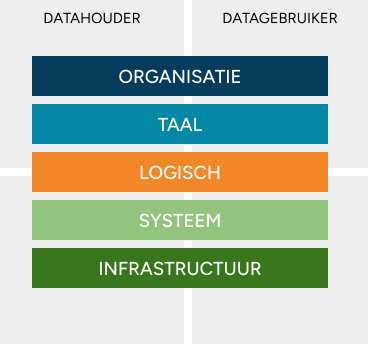

# PLUGIN ondersteund datahouders in het veilig beschikbaar stellen van gezondheidsgegevens

Ziekenhuizen en andere datahouders staan voor een grote opgave om gezondheidsgegevens op grotere schaal beschikbaar te stellen voor hergebruik voor onderzoek,beleid en innovatie. De hoeveelheid gegevensverzoeken bij datahouders blijft onverminderd stijgen. Tegelijkertijd zien we dat veel van deze verzoeken of samenwerkingsverbanden allemaal een eigen infrastructuur nodig hebben. Dit terwijl de ontwikkelkalender van de IT afdeling al overvol is. Er is daarom dringend behoefte om op een __open, gestandaardiseerde__ en __veilige__ manier data beschikbaar te stellen. Dit is wat PLUGIN biedt.

PLUGIN is een spin-off van Dutch Hospital Data (DHD) en brengt daarmee jarenlange ervaring met het implementeren en beheren van data verwerkingsomgevingen voor de zorg. Het vernieuwende van PLUGIN is dat sinds 2022 heeft gewerkt aan een landelijk dekkend, decentraal netwerk van zogenaamde data stations, waarmee hergebruik van gezondheidsgegevens op een betrouwbare en kosteneffectieve manier gerealiseerd kan worden. Per december 2025 zijn dan de helft van alle Nederlandse ziekenhuizen aangesloten op dit netwerk.

Wat PLUGIN kan betekenen voor datahouders wordt in de volgende pagina's uitgelegd. Daarbij wordt PLUGIN op vijf verschillende niveaus uitgelegd: organisatie, taal, logisch (informatiemodel), systeem en infrastructuur.

<figure markdown="span">
  { width="400" }
</figure>

