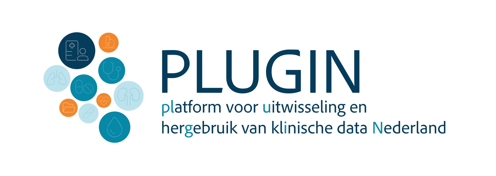

# _Solidair met onze gezondheidsdata, voor de zorg van morgen_

In Nederlandse ziekenhuizen is ontzettend veel waardevolle kennis aanwezig. Gegevens over behandelingen en uitkomsten kunnen ons helpen om de zorg van morgen te verbeteren. Maar hoe delen we deze inzichten zonder de privacy van patiënten in gevaar te brengen en zonder dat medische gegevens zomaar 'op straat' komen te liggen? Dat is waar **PLUGIN** voor staat.

 

## Wat is PLUGIN?
PLUGIN is een data infrastructuur van en vóór de Nederlandse ziekenhuiszorg. Het is een zogeheten **Health Data Space**: een veilige, digitale omgeving waarin zorgdata hergebruikt kan worden voor wetenschappelijk onderzoek, innovatie en beleid - ook wel secundair gebruik genoemd.

Het unieke aan PLUGIN is dat het een initiatief is van en vóór de zorg zelf, met een publiek karakter zonder winstoogmerk. Daarmee willen we waarborgen dat onze zordata op een solidaire en betrouwbare manier wordt hergebruikt en daarmee publieke, maatschappelijke waarde creëert.

### Hoe het werkt: data blijven zoveel als mogelijk bij de bron
Traditioneel worden voor hergebruik van gezondeheidsgegevens vaak kopieën van medische dossiers naar één centrale database gestuurd. Dat brengt veel risico's met zich mee. PLUGIN draait dit om. Wij werken volgens het principe dat **data bij de bron blijven**.

In plaats van de gegevens te verplaatsen naar de datagebruiker, brengen wij de onderzoeksvraag naar de data toe. De gegevens blijven veilig binnen de muren van het ziekenhuis staan. Onze technologie zorgt ervoor dat de analyse in het ziekenhuis zelf plaatsvindt en alleen de uitkomsten worden gedeeld. Een dergelijke manier van werken wordt ook wel *federatief analyseren* of *federatief leren* genoemd.

In het geval dat het niet anders kan, zoals bijvoorbeeld wanneer data verschillende zorginstellingen gecombineerd moeten worden of dat de data moeten worden opgenomen in een landelijke registratie, worden de data via het PLUGIN netwerk op een veilige manier doorgestuurd naar een centrale analyse omgeving.

### Wat doet PLUGIN concreet?
Wij leveren de diensten die nodig zijn om deze samenwerking mogelijk te maken. Dit doen we op drie niveaus:

* **Toezien op eerlijke spelregels:** Wij zorgen voor de spelregels, het toezicht en de centrale 'telefoonboek'-functie zodat onderzoekers en ziekenhuizen elkaar veilig kunnen vinden.
* **Ziekenhuizen helpen met het aansluiten op PLUGIN:** Wij ondersteunen ziekenhuizen bij de techniek om aan te sluiten en daarmee hun data op een gecontroleerde manier beschikbaar te stellen. We helpen met de installatie van de benodigde software en het beheer en ontlasten daarmee de organisatie.
* **Gebruikers helpen de data te gebruiken:** Wij bieden onderzoekers de gereedschappen om – zonder de data te zien – toch gedetailleerde analyses en specifieke berekeningen te doen op de gegevens. Zo zetten we data om in waardevolle inzichten voor de zorg.

Samen bouwen we aan een lerend zorgsysteem, waarin veiligheid, betrouwbaarheid en medische vooruitgang hand in hand gaan.

 
 

- <figure markdown="span">{ width=200 }</figure> PLUGIN ondersteund [**datahouders**](./datahouder/index.md) in het veilig beschikbaar stellen van gezondheidsgegevens.

- <figure markdown="span">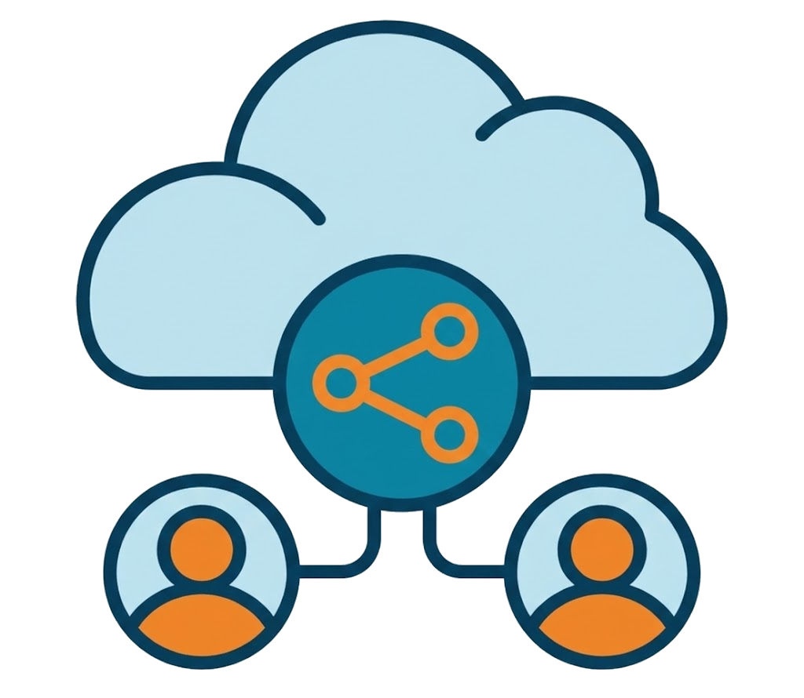{ width=200 }</figure> PLUGIN ondersteund [**datagebruikers**](./datagebruiker/index.md) met het hergebruik van data voor onderzoek, beleid en innovatie.

 

### Inmiddels zijn 36 ziekenhuizen aangesloten op PLUGIN

<!-- 
 -->
  

    

    

    

      

        

          
        

        

          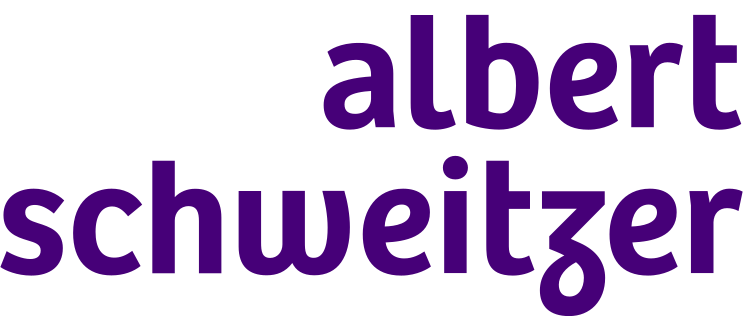
        

        

          
        

        

          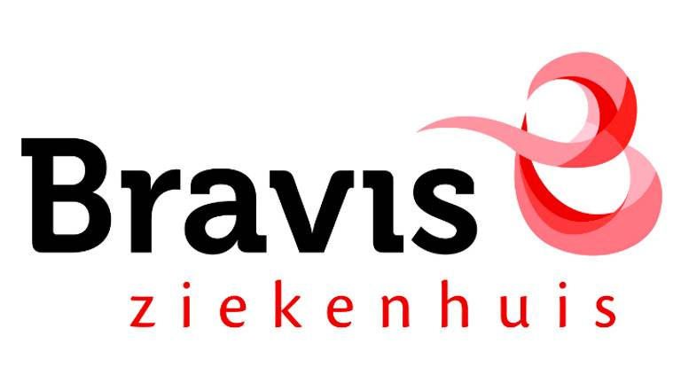
        

        

          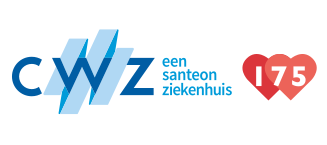
        

        

          
        

        

          
        

        

          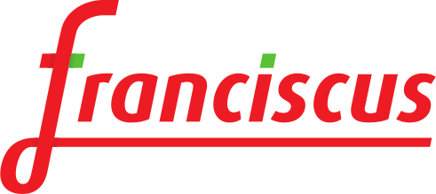
        

        

          
        

        

          
        

        

          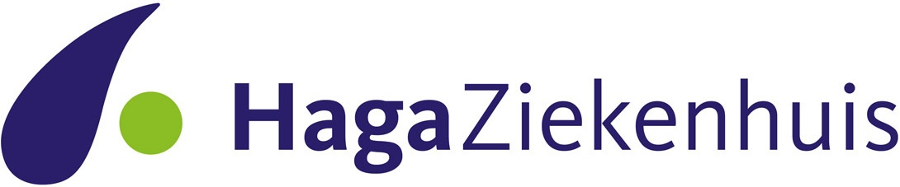
        

        

          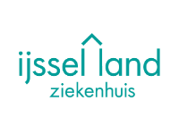
        

        

          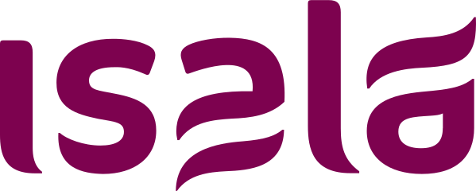
        

        

          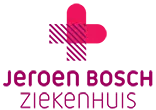
        

        

          
        

        

          
        

        

          
        

        

          
        

        

          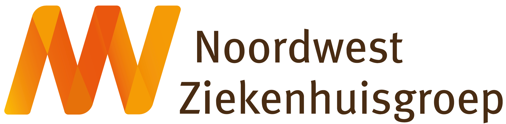
        

        

          
        

        

          
        

        

          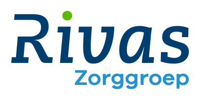
        

        

          
        

        

          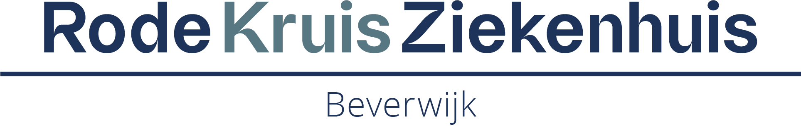
        

        

          
        

        

          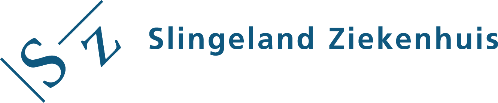
        

        

          
        

        

          
        

        

          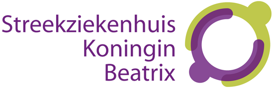
        

        

          
        

        

          
        

        

          
        

        

          
        

        

          
        

        

          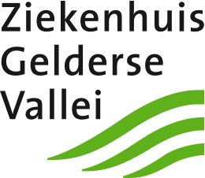
        

        

          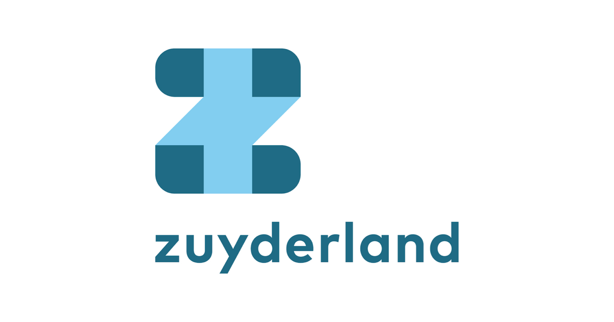
        

        

          
        

      

    

  

<!-- 
 -->

---

 

### PLUGIN is klaar voor de toekomst: de Europese context

De zorg houdt niet op bij de landsgrenzen. De Europese Unie werkt aan de **European Health Data Space (EHDS)**: een set nieuwe wetten en afspraken die het makkelijker moet maken om gezondheidsdata veilig te delen binnen Europa. Nederland bouwt hiervoor aan een Landelijk Dekkend Netwerk. PLUGIN is hier een onderdeel van: sinds 2022 werken wij met een partners uit het veld om dit te realiseren en bereiden we de functionaliteit en dekkingsgraad van PLUGIN steeds verder uit.

PLUGIN bereidt Nederlandse ziekenhuizen voor op deze toekomst. Wij zorgen dat de techniek en de afspraken zo zijn ingericht dat we straks naadloos en veilig kunnen aansluiten op dit Europese netwerk.

 

### PLUGIN voor open en solidair hergebruik van data

- :lucide-folder-code: __Gebouwd op open source__  [Lees meer :octicons-arrow-right-24:](community/ontwikkelaar.md)
- :lucide-signpost-big: __Een referentieimplementatie van data stations__  [Lees meer :octicons-arrow-right-24:](https://health-ri.github.io/data-station-specification/)

